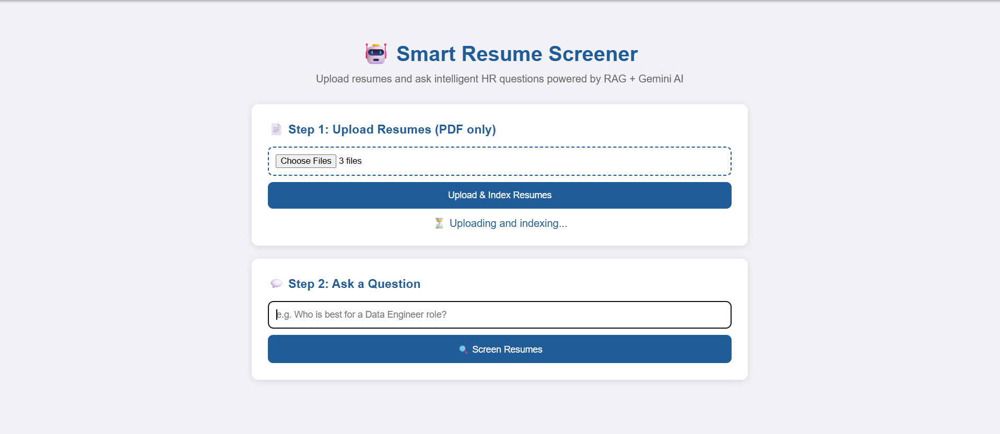

# 🤖 Smart Resume Screener
### RAG-Based HR Intelligence Tool powered by Gemini Embeddings + Groq LLM


---

## 🎯 Overview
Smart Resume Screener is a production-grade RAG application that intelligently screens and ranks multiple resumes using natural language queries, simulating AI-powered HR recruitment.

Upload multiple PDF resumes, ask questions like *"Who is best for a Data Engineer role?"* and get structured, AI-powered answers instantly.

---

---
## 📸 Demo

### Upload & Index Resumes


### AI-Powered Screening Result  


---


## 🏗️ Architecture

```
PDF Resumes → PyPDF Loader → Text Chunking → Gemini Embeddings → FAISS Vector Store → Groq LLM → Answer
```

| Component | Technology | Purpose |
|-----------|-----------|---------|
| **Embeddings** | Google Gemini API | Converts resume text into semantic vectors |
| **Vector Store** | FAISS | Fast similarity search across resume chunks |
| **LLM** | Groq llama-3.1-8b-instant | Generates structured HR answers |
| **Backend** | Flask | REST API server |

---

## ✨ Features
- 📄 Upload multiple PDF resumes simultaneously
- 🔍 Semantic search using Gemini embeddings + FAISS
- 🤖 Fast LLM responses via Groq
- 💬 Ask natural language HR questions
- 📁 Source attribution, shows which resume each answer came from

---

## 🚀 Getting Started

### 1. Clone Repository
```bash
git clone https://github.com/jaweriafayyaz/smart-resume-screener.git
cd smart-resume-screener
```

### 2. Create Virtual Environment
```bash
python -m venv venv
venv\Scripts\activate
```

### 3. Install Dependencies
```bash
pip install flask langchain langchain-community langchain-text-splitters faiss-cpu pypdf google-genai groq python-dotenv
```

### 4. Configure API Keys
Create `.env` file:
```
GEMINI_API_KEY=your_gemini_api_key_here
GROQ_API_KEY=your_groq_api_key_here
```

### 5. Run
```bash
python app.py
```
Open → **http://localhost:5000**

---

## 🔑 API Keys (Both Free)
| API | Get Key |
|-----|---------|
| Google Gemini | [aistudio.google.com](https://aistudio.google.com) |
| Groq | [console.groq.com](https://console.groq.com) |

---

## 💬 Example Questions
- *"Who is best suited for a Data Engineer role?"*
- *"Which candidate has the most Python experience?"*
- *"Compare all candidates for an AI Engineer position"*
- *"Summarize each candidate in 2 sentences"*

---

## 📁 Project Structure
```
smart-resume-screener/
├── app.py              ← Flask backend
├── rag_pipeline.py     ← RAG pipeline
├── templates/
│   └── index.html      ← Frontend UI
├── .env                ← API keys (gitignored)
└── README.md
```

---

## 📞 Contact
- 📧 jaweriafayyaz474@gmail.com
- 💼 [LinkedIn](https://www.linkedin.com/in/jaweria-fayyaz/)
- 🐙 [GitHub](https://github.com/jaweriafayyaz)

---

<div align="center">

⭐ Star this repo if it helped you!

**Built with ❤️ by Jaweria Fayyaz**

</div>
